# MeshPay Architecture Overview and Diagrams
## Offline Payment System over Wireless Mesh Network

**Date:** January 2025  
**Version:** 1.0  
**Status:** Architecture Documentation

---

## Table of Contents

1. [System Architecture Overview](#1-system-architecture-overview)
2. [Network Topology](#2-network-topology)
3. [Protocol Flow Diagrams](#3-protocol-flow-diagrams)
4. [Node Connection and Discovery](#4-node-connection-and-discovery)
5. [Transfer Order Processing](#5-transfer-order-processing)
6. [Withdrawal Architecture Proposal](#6-withdrawal-architecture-proposal)
7. [Security Mechanisms](#7-security-mechanisms)

---

## 1. System Architecture Overview

### 1.1 High-Level Architecture

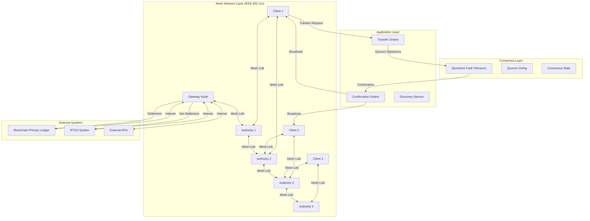

### 1.2 Component Stack

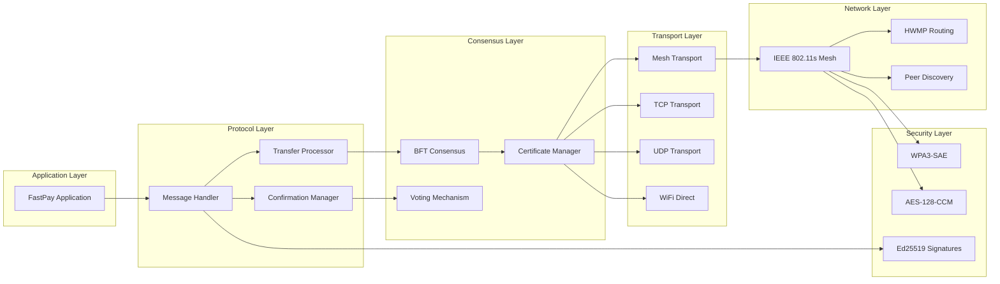

---

## 2. Network Topology

### 2.1 Mesh Network Topology

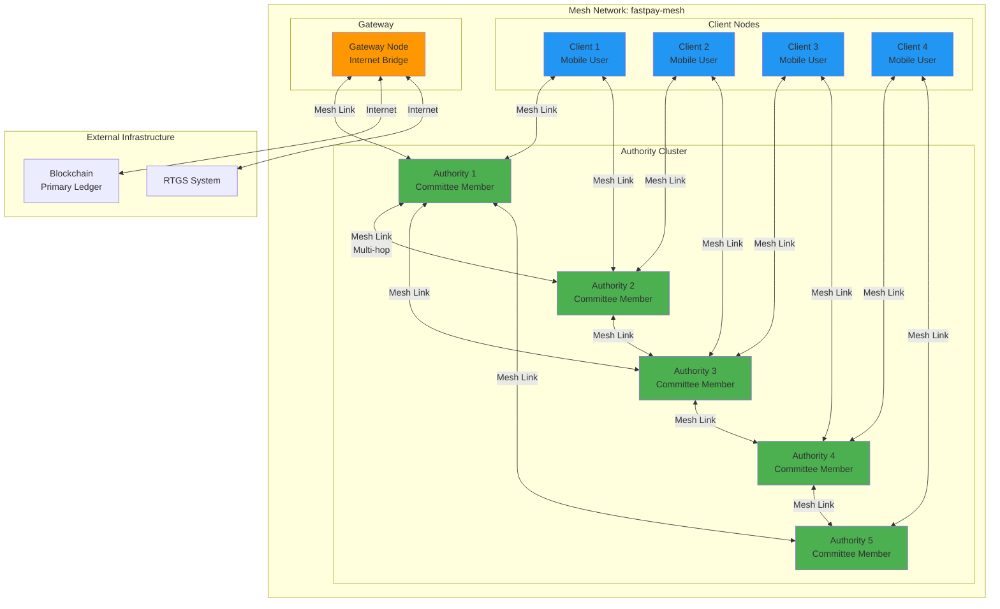

### 2.2 Multi-Hop Routing Example


**Key Features:**
- **Self-healing:** Automatic path recalculation on node failure
- **Load balancing:** Multiple paths to same destination
- **Range extension:** Coverage beyond single-hop limitations
- **Scalability:** Supports 1000+ nodes

---

## 3. Protocol Flow Diagrams

### 3.1 Complete Transfer Order Flow

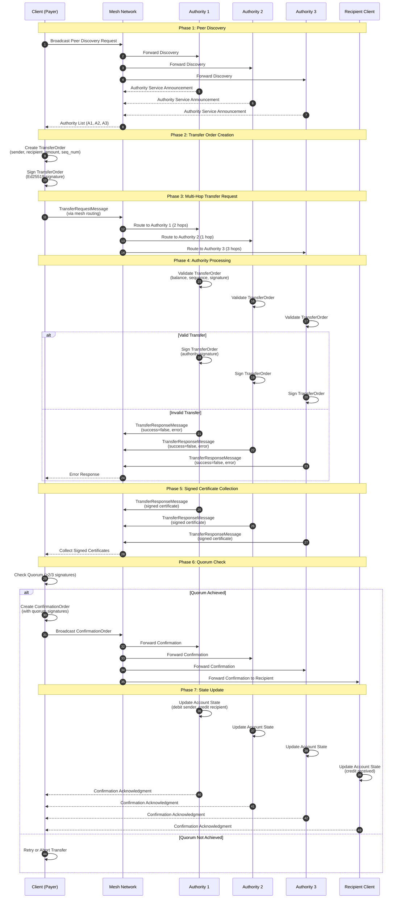

### 3.2 Node Connection and Discovery Flow

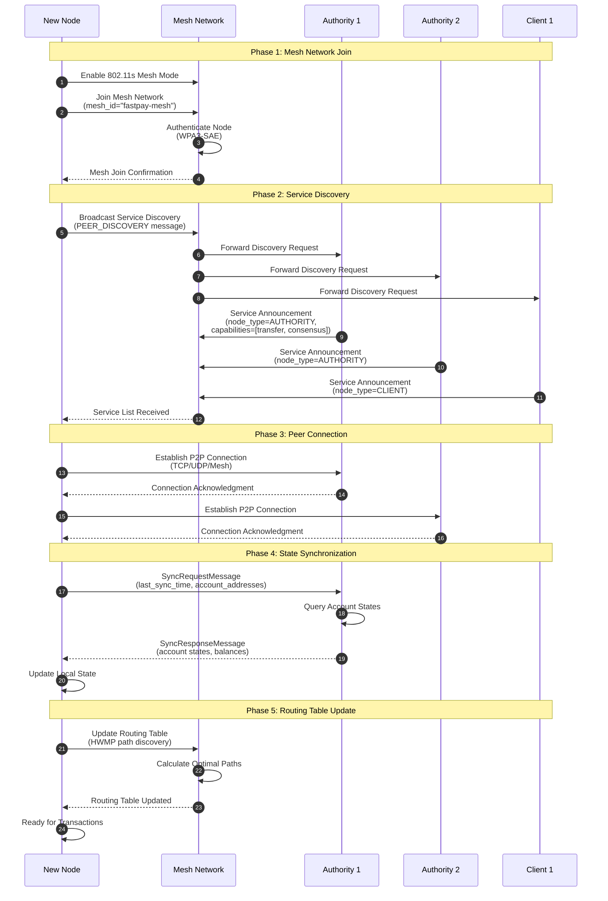

### 3.3 Authority Committee Consensus Flow

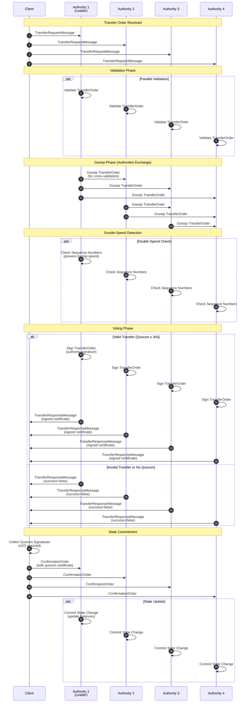

---

## 4. Node Connection and Discovery

### 4.1 Mesh Peer Discovery Architecture

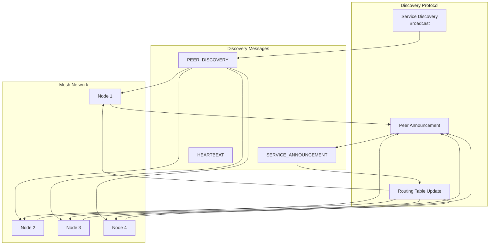

### 4.2 Connection State Machine

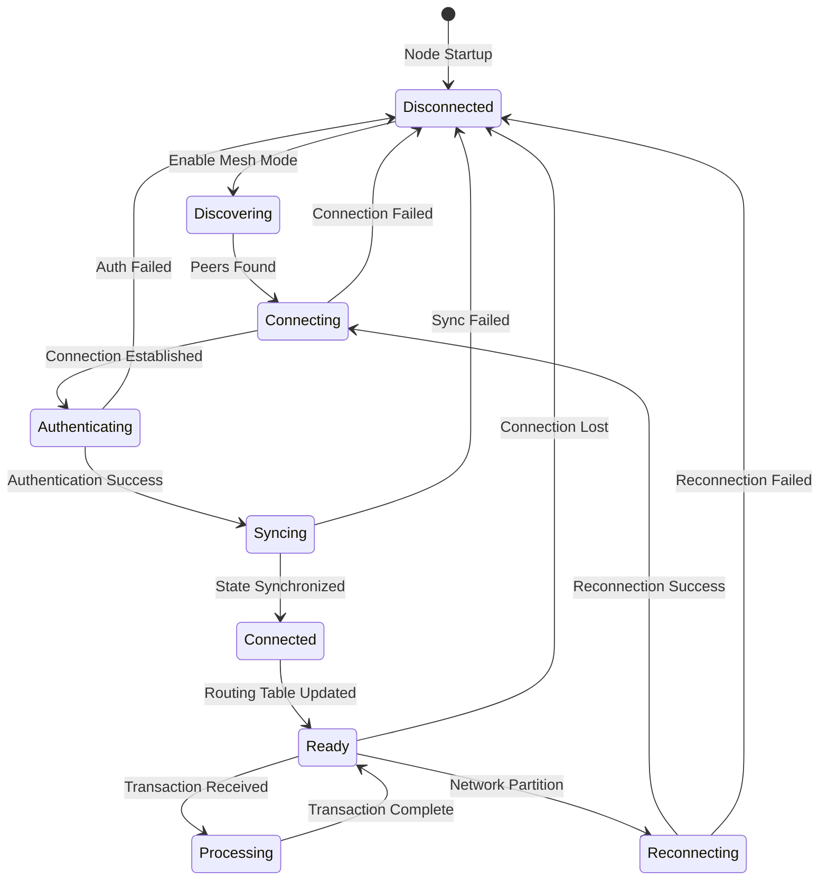

---

## 5. Transfer Order Processing

### 5.1 Transfer Order Lifecycle

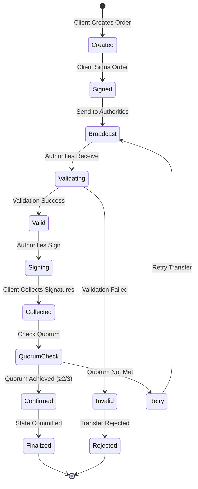

### 5.2 Transfer Order Data Flow

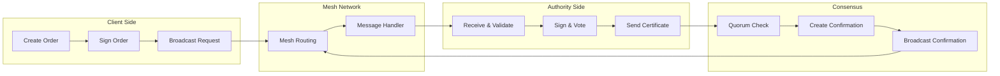

---

## 6. Withdrawal Architecture Proposal

### 6.1 Withdrawal System Architecture

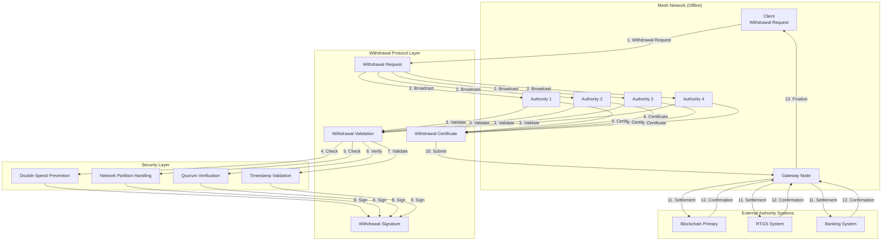

### 6.2 Withdrawal Protocol Flow

```mermaid
sequenceDiagram
    autonumber
    participant C as Client
    participant A1 as Authority 1
    participant A2 as Authority 2
    participant A3 as Authority 3
    participant A4 as Authority 4
    participant GW as Gateway
    participant BC as Blockchain/RTGS
    
    Note over C,BC: Phase 1: Withdrawal Request
    C->>C: Create WithdrawalOrder<br/>(amount, recipient_address,<br/>token_address, sequence)
    C->>C: Sign WithdrawalOrder<br/>(Ed25519 signature)
    C->>A1: WithdrawalRequestMessage<br/>(via mesh)
    C->>A2: WithdrawalRequestMessage
    C->>A3: WithdrawalRequestMessage
    C->>A4: WithdrawalRequestMessage
    
    Note over C,BC: Phase 2: Double-Spend Prevention
    par Parallel Double-Spend Check
        A1->>A1: Check Sequence Number<br/>(prevent replay)
        A2->>A2: Check Sequence Number
        A3->>A3: Check Sequence Number
        A4->>A4: Check Sequence Number
    end
    
    par Balance Verification
        A1->>A1: Verify Mesh Balance<br/>(sufficient funds)
        A2->>A2: Verify Mesh Balance
        A3->>A3: Verify Mesh Balance
        A4->>A4: Verify Mesh Balance
    end
    
    par Network Partition Check
        A1->>A2: Heartbeat Check
        A1->>A3: Heartbeat Check
        A1->>A4: Heartbeat Check
        A2->>A3: Heartbeat Check
        A2->>A4: Heartbeat Check
        A3->>A4: Heartbeat Check
    end
    
    Note over C,BC: Phase 3: Quorum Validation
    alt Quorum Achieved (≥3/4) & No Partition
        A1->>A1: Lock Mesh Balance<br/>(prevent double-spend)
        A2->>A2: Lock Mesh Balance
        A3->>A3: Lock Mesh Balance
        A4->>A4: Lock Mesh Balance
        
        A1->>A1: Sign WithdrawalOrder<br/>(authority signature)
        A2->>A2: Sign WithdrawalOrder
        A3->>A3: Sign WithdrawalOrder
        A4->>A4: Sign WithdrawalOrder
        
        A1->>C: WithdrawalResponseMessage<br/>(signed certificate)
        A2->>C: WithdrawalResponseMessage
        A3->>C: WithdrawalResponseMessage
        A4->>C: WithdrawalResponseMessage
    else Network Partition Detected
        A1->>C: WithdrawalResponseMessage<br/>(error: partition detected)
        A2->>C: WithdrawalResponseMessage<br/>(error: partition detected)
        Note over C,BC: Client must wait for partition resolution
    else Insufficient Quorum
        A1->>C: WithdrawalResponseMessage<br/>(error: insufficient quorum)
        Note over C,BC: Retry or abort withdrawal
    end
    
    Note over C,BC: Phase 4: Certificate Collection
    C->>C: Collect Quorum Signatures<br/>(≥2/3 required)
    C->>C: Create WithdrawalCertificate<br/>(with quorum proof)
    
    Note over C,BC: Phase 5: Gateway Submission
    C->>GW: Submit WithdrawalCertificate<br/>(via mesh or direct connection)
    GW->>GW: Validate Certificate<br/>(verify quorum signatures)
    
    alt Certificate Valid
        GW->>BC: Submit Settlement Transaction<br/>(unlock escrow, transfer funds)
        BC->>BC: Validate on Primary Ledger
        BC->>BC: Execute Settlement
        BC-->>GW: Settlement Confirmation
        GW->>GW: Update Mesh State<br/>(debit locked balance)
        GW->>A1: Broadcast State Update
        GW->>A2: Broadcast State Update
        GW->>A3: Broadcast State Update
        GW->>A4: Broadcast State Update
        
        A1->>A1: Unlock & Debit Balance
        A2->>A2: Unlock & Debit Balance
        A3->>A3: Unlock & Debit Balance
        A4->>A4: Unlock & Debit Balance
        
        GW-->>C: Withdrawal Finalized<br/>(transaction hash)
    else Certificate Invalid
        GW-->>C: Withdrawal Rejected<br/>(invalid certificate)
        Note over C,BC: Unlock mesh balance
        A1->>A1: Unlock Balance
        A2->>A2: Unlock Balance
        A3->>A3: Unlock Balance
        A4->>A4: Unlock Balance
    end
```

### 6.3 Network Partition Handling

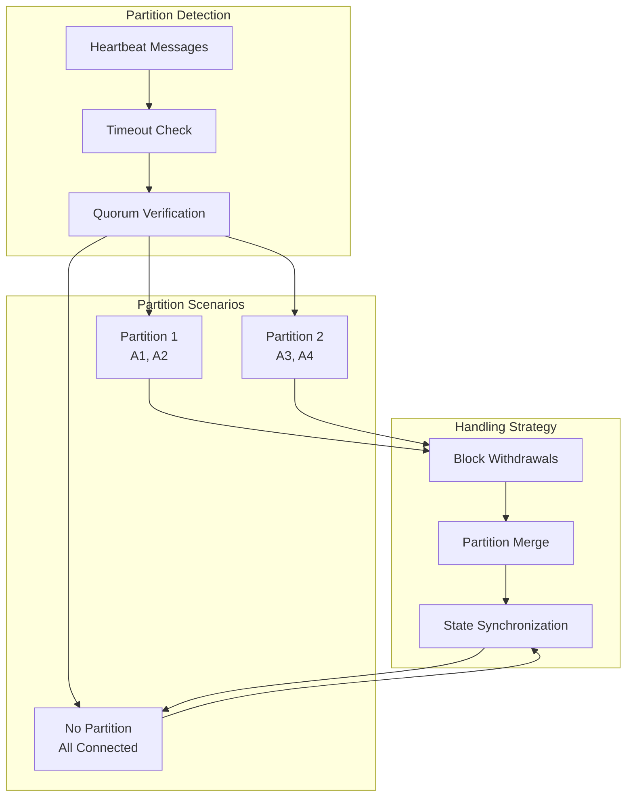

### 6.4 Double-Spend Prevention Mechanism

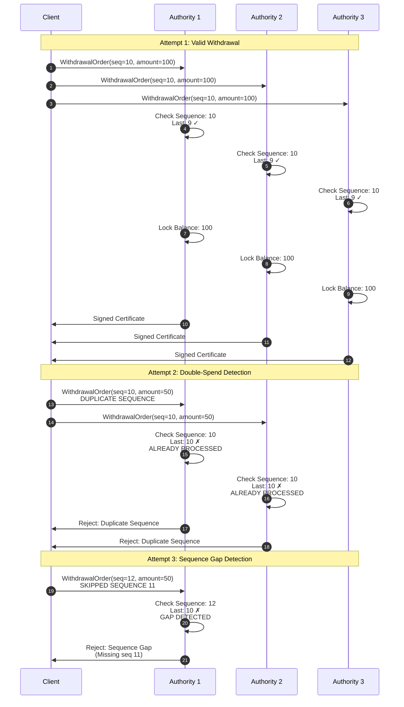

### 6.5 Withdrawal State Machine

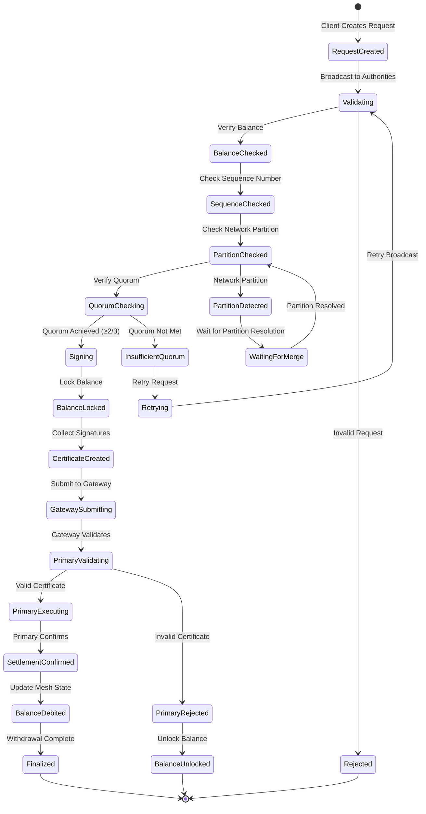

---

## 7. Security Mechanisms

### 7.1 Multi-Layer Security Architecture

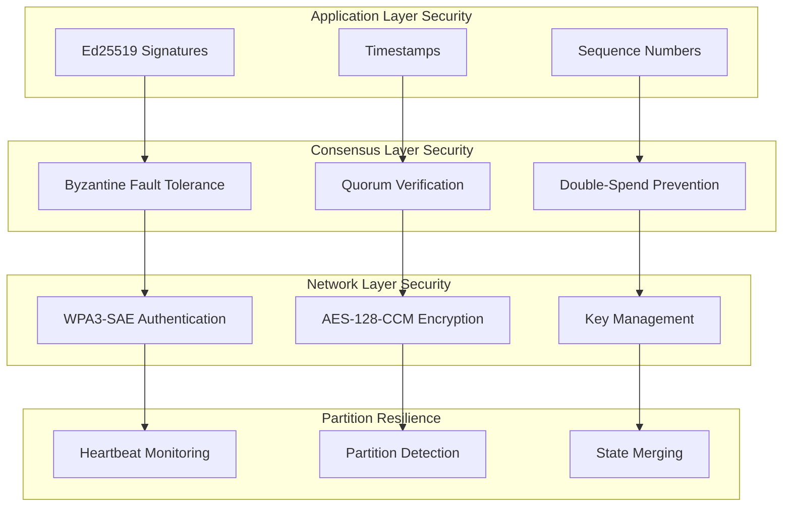

### 7.2 Security Properties

#### 7.2.1 Double-Spend Prevention

**Mechanisms:**
1. **Sequence Number Tracking:** Each account maintains a strictly increasing sequence number
2. **Authority Validation:** All authorities verify sequence numbers before signing
3. **Balance Locking:** Temporary balance locks during withdrawal processing
4. **Quorum Requirement:** Multiple authorities must agree (≥2/3 quorum)

**Flow:**
```
Client → Authority: TransferOrder(seq=N)
Authority: Check if seq > last_processed_seq
  ├─ Yes: Process and update last_processed_seq
  └─ No: Reject (double-spend attempt)
```

#### 7.2.2 Network Partition Handling

**Detection:**
- Heartbeat messages between authorities
- Timeout-based partition detection
- Quorum availability check

**Handling:**
- Block withdrawals during partition
- Continue processing transfers within partition (if quorum maintained)
- Merge state when partition resolves
- Conflict resolution using timestamps and sequence numbers

**Partition Scenarios:**

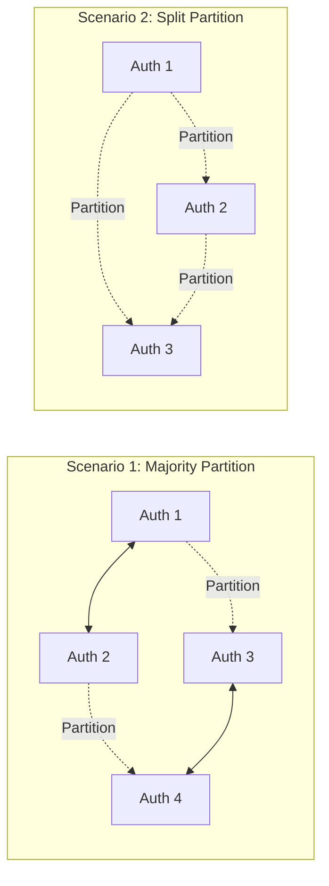

**Resolution Strategy:**
1. **Detect Partition:** Authorities detect missing heartbeats
2. **Block Withdrawals:** Prevent withdrawals until partition resolves
3. **Continue Transfers:** Allow transfers within partition if quorum maintained
4. **State Merge:** When partition resolves, merge state using conflict resolution
5. **Validate Consistency:** Ensure no double-spends occurred during partition

---

## 8. Architecture Summary

### 8.1 Key Components

| Component | Responsibility | Key Features |
|-----------|---------------|--------------|
| **Mesh Network** | Physical connectivity | IEEE 802.11s, Multi-hop routing, Self-healing |
| **Client Node** | Payment initiation | Transfer creation, Certificate collection |
| **Authority Node** | Consensus & validation | BFT voting, State management, Signature generation |
| **Gateway Node** | External bridge | Primary ledger connection, Settlement execution |
| **Transport Layer** | Message delivery | TCP/UDP/Mesh routing, Reliable delivery |
| **Security Layer** | Protection mechanisms | Encryption, Authentication, Double-spend prevention |

### 8.2 Protocol Characteristics

- **Consensus:** Byzantine Fault Tolerant (BFT) with quorum voting
- **Quorum Requirement:** ≥2/3 of authorities must agree
- **Network Type:** IEEE 802.11s Mesh (supports 1000+ nodes)
- **Security:** Multi-layer (WPA3-SAE, AES-128-CCM, Ed25519)
- **Fault Tolerance:** Handles up to 33% Byzantine nodes
- **Partition Resilience:** Detects and handles network partitions
- **Double-Spend Prevention:** Sequence numbers + balance locking

### 8.3 Withdrawal Architecture Highlights

1. **Multi-Authority Validation:** Requires quorum of authorities
2. **Double-Spend Prevention:** Sequence number tracking + balance locking
3. **Partition Handling:** Blocks withdrawals during partitions, merges state on resolution
4. **Gateway Integration:** Secure connection to primary ledger/RTGS
5. **State Consistency:** Ensures mesh state matches primary ledger after withdrawal

---

## 9. Implementation Notes

### 9.1 Message Types

- `TRANSFER_REQUEST`: Client → Authority (transfer initiation)
- `TRANSFER_RESPONSE`: Authority → Client (signed certificate)
- `CONFIRMATION_REQUEST`: Client → Authority (confirmation broadcast)
- `WITHDRAWAL_REQUEST`: Client → Authority (withdrawal initiation)
- `WITHDRAWAL_RESPONSE`: Authority → Client (withdrawal certificate)
- `SYNC_REQUEST`: Node → Authority (state synchronization)
- `PEER_DISCOVERY`: Broadcast (service discovery)
- `HEARTBEAT`: Authority ↔ Authority (partition detection)

### 9.2 State Management

- **Account State:** Balance, sequence number, pending transfers
- **Authority State:** Committee membership, account shards, signatures
- **Network State:** Routing tables, peer connections, partition status

### 9.3 Performance Characteristics

- **Transfer Latency:** <100ms (single-hop), <500ms (multi-hop)
- **Throughput:** 80k+ TPS (theoretical, mesh-dependent)
- **Scalability:** 1000+ nodes supported
- **Recovery Time:** <2.3 seconds (node failure recovery)

---

**Document Status:** Complete  
**Last Updated:** January 2025  
**Author:** Architecture Documentation Team
