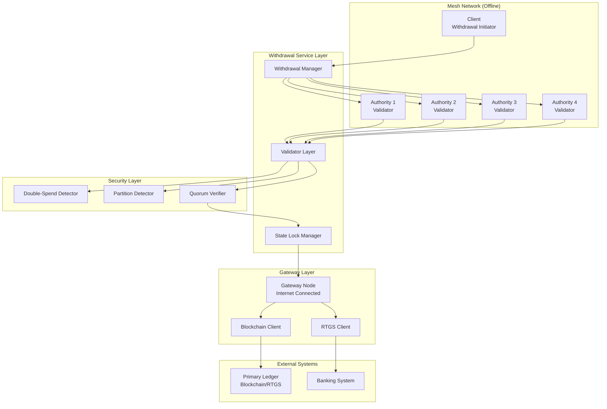
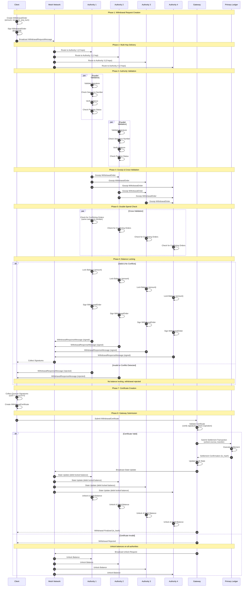
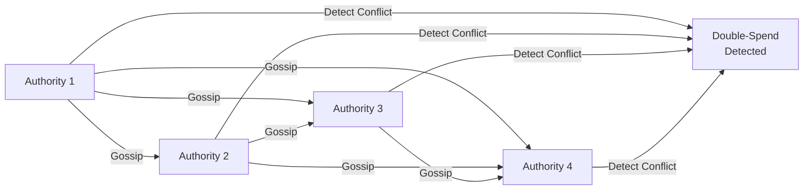

# Withdrawal Architecture Proposal
## Secure User Withdrawal from MeshPay Application

**Date:** January 2025  
**Version:** 1.0  
**Status:** Architecture Proposal

---

## Executive Summary

This document proposes a secure withdrawal architecture that allows users to withdraw funds from the MeshPay offline payment system by interacting with authorities. The architecture addresses critical security concerns including double-spending prevention and network partition handling.

---

## Table of Contents

1. [Problem Statement](#1-problem-statement)
2. [Architecture Overview](#2-architecture-overview)
3. [Security Requirements](#3-security-requirements)
4. [Protocol Design](#4-protocol-design)
5. [Double-Spend Prevention](#5-double-spend-prevention)
6. [Network Partition Handling](#6-network-partition-handling)
7. [Implementation Details](#7-implementation-details)
8. [Threat Analysis](#8-threat-analysis)

---

## 1. Problem Statement

### 1.1 Requirements

Users need to withdraw funds from the MeshPay application to external systems (blockchain, RTGS, banking systems) while maintaining:

1. **Security:** Prevent double-spending attacks
2. **Consistency:** Ensure state consistency across network partitions
3. **Availability:** Handle withdrawals even during partial network failures
4. **Auditability:** Maintain complete transaction history
5. **Performance:** Sub-second withdrawal initiation, settlement within minutes

### 1.2 Challenges

- **Offline Operation:** Mesh network may be disconnected from primary ledger
- **Network Partitions:** Authorities may be split into disconnected groups
- **Byzantine Failures:** Some authorities may be malicious or compromised
- **State Synchronization:** Ensuring consistency between mesh and primary ledger

---

## 2. Architecture Overview

### 2.1 System Components



### 2.2 Withdrawal Flow Overview

```
┌─────────────────────────────────────────────────────────────┐
│                    Withdrawal Flow                           │
├─────────────────────────────────────────────────────────────┤
│                                                              │
│  1. Client creates withdrawal request                        │
│     └─> WithdrawalOrder(amount, recipient, sequence)        │
│                                                              │
│  2. Broadcast to authorities via mesh network               │
│     └─> Multi-hop routing to all authorities                 │
│                                                              │
│  3. Authorities validate request                             │
│     ├─> Balance verification                                 │
│     ├─> Sequence number check (double-spend prevention)      │
│     ├─> Network partition detection                          │
│     └─> Quorum availability check                            │
│                                                              │
│  4. Lock balance (prevent double-spend)                      │
│     └─> Temporary lock on mesh balance                       │
│                                                              │
│  5. Collect quorum signatures (≥2/3)                         │
│     └─> Create WithdrawalCertificate                         │
│                                                              │
│  6. Submit to gateway                                        │
│     └─> Gateway validates certificate                        │
│                                                              │
│  7. Gateway submits to primary ledger                         │
│     └─> Unlock escrow, transfer funds                        │
│                                                              │
│  8. Update mesh state                                        │
│     └─> Debit locked balance, broadcast update              │
│                                                              │
│  9. Finalize withdrawal                                      │
│     └─> Client receives confirmation                         │
│                                                              │
└─────────────────────────────────────────────────────────────┘
```

---

## 3. Security Requirements

### 3.1 Security Properties

| Property | Description | Mechanism |
|----------|-------------|-----------|
| **Double-Spend Prevention** | Prevent same funds from being withdrawn twice | Sequence numbers + balance locking |
| **Partition Resilience** | Handle network splits gracefully | Partition detection + state merging |
| **Byzantine Fault Tolerance** | Tolerate up to 33% malicious authorities | BFT consensus + quorum voting |
| **State Consistency** | Ensure mesh state matches primary ledger | Gateway synchronization |
| **Non-Repudiation** | Prevent denial of withdrawal requests | Cryptographic signatures |
| **Auditability** | Complete transaction history | Immutable logs + certificates |

### 3.2 Threat Model

#### Threat 1: Double-Spending Attack
- **Attack:** Client attempts to withdraw same funds multiple times
- **Mitigation:** Sequence number tracking + balance locking
- **Detection:** Authorities check sequence numbers before signing

#### Threat 2: Network Partition Exploitation
- **Attack:** Exploit partition to withdraw funds twice in different partitions
- **Mitigation:** Block withdrawals during partitions, merge state on resolution
- **Detection:** Heartbeat monitoring + quorum verification

#### Threat 3: Byzantine Authority
- **Attack:** Malicious authority signs invalid withdrawals
- **Mitigation:** Quorum requirement (≥2/3), signature verification
- **Detection:** Cross-validation between authorities

#### Threat 4: Replay Attack
- **Attack:** Replay old withdrawal certificate
- **Mitigation:** Timestamps + sequence numbers + certificate expiration
- **Detection:** Gateway validates certificate freshness

---

## 4. Protocol Design

### 4.1 Withdrawal Request Message

```python
@dataclass
class WithdrawalOrder:
    """Withdrawal order from client to authorities."""
    
    order_id: UUID
    client_address: str
    recipient_address: str  # External address (blockchain, bank account)
    token_address: str
    amount: int
    sequence_number: int  # Critical for double-spend prevention
    timestamp: float
    signature: str  # Client's Ed25519 signature
    
@dataclass
class WithdrawalRequestMessage:
    """Message wrapper for withdrawal order."""
    
    message_id: UUID
    message_type: MessageType.WITHDRAWAL_REQUEST
    sender: Address
    withdrawal_order: WithdrawalOrder
    timestamp: float
```

### 4.2 Withdrawal Certificate

```python
@dataclass
class WithdrawalCertificate:
    """Certificate proving quorum approval for withdrawal."""
    
    order_id: UUID
    withdrawal_order: WithdrawalOrder
    authority_signatures: Dict[str, str]  # Map of authority_name -> signature
    quorum_proof: QuorumProof  # Proof that ≥2/3 signed
    created_at: float
    expires_at: float  # Certificate expiration (e.g., 1 hour)
    
@dataclass
class QuorumProof:
    """Proof that quorum was achieved."""
    
    total_authorities: int
    signing_authorities: List[str]
    quorum_threshold: float  # e.g., 0.67 for 2/3
    achieved: bool
```

### 4.3 Detailed Protocol Sequence



---

## 5. Double-Spend Prevention

### 5.1 Sequence Number Mechanism

Each account maintains a **strictly increasing sequence number** that tracks all spending actions (transfers and withdrawals).

**Properties:**
- Sequence numbers must be strictly increasing
- Gaps are not allowed (missing sequence indicates potential issue)
- Duplicate sequence numbers indicate double-spend attempt

**Implementation:**

```python
class AccountState:
    last_sequence_number: int
    pending_sequences: Set[int]  # Sequences currently being processed
    locked_balances: Dict[int, int]  # Map sequence -> locked amount
    
    def validate_sequence(self, seq: int) -> bool:
        """Validate sequence number prevents double-spend."""
        if seq <= self.last_sequence_number:
            return False  # Replay or double-spend attempt
        if seq in self.pending_sequences:
            return False  # Already processing this sequence
        if seq > self.last_sequence_number + 1:
            return False  # Gap detected (missing previous sequence)
        return True
    
    def lock_balance(self, seq: int, amount: int) -> bool:
        """Lock balance for withdrawal."""
        if not self.validate_sequence(seq):
            return False
        if self.balance < amount:
            return False
        self.pending_sequences.add(seq)
        self.locked_balances[seq] = amount
        self.balance -= amount
        return True
```

### 5.2 Balance Locking

**Temporary locks** prevent double-spending during withdrawal processing:

1. **Lock on Request:** When authority validates withdrawal, temporarily lock balance
2. **Lock Duration:** Until withdrawal is finalized or rejected
3. **Lock Release:** Automatically released if withdrawal fails or times out

**Lock States:**

```
┌─────────────────────────────────────────┐
│         Balance Lock Lifecycle          │
├─────────────────────────────────────────┤
│                                         │
│  Available → Locked → Processing        │
│     ↑           │           │           │
│     │           │           │           │
│     └───────────┴───────────┘           │
│              │                           │
│              ↓                           │
│         Finalized / Rejected             │
│                                         │
└─────────────────────────────────────────┘
```

### 5.3 Cross-Authority Validation

Authorities **gossip withdrawal orders** to detect conflicts:



**Conflict Detection Algorithm:**

```python
def detect_conflict(self, withdrawal_order: WithdrawalOrder) -> bool:
    """Detect if withdrawal conflicts with existing orders."""
    # Check local pending withdrawals
    for pending in self.pending_withdrawals:
        if (pending.client_address == withdrawal_order.client_address and
            pending.sequence_number == withdrawal_order.sequence_number):
            return True  # Duplicate sequence detected
    
    # Check gossiped orders from other authorities
    for gossiped in self.gossiped_orders:
        if (gossiped.client_address == withdrawal_order.client_address and
            gossiped.sequence_number == withdrawal_order.sequence_number and
            gossiped.order_id != withdrawal_order.order_id):
            return True  # Conflict detected
    
    return False
```

---

## 6. Network Partition Handling

### 6.1 Partition Detection

**Mechanisms:**

1. **Heartbeat Messages:** Authorities send periodic heartbeats
2. **Timeout Detection:** Missing heartbeats indicate partition
3. **Quorum Verification:** Check if quorum is still achievable

**Heartbeat Protocol:**

```python
@dataclass
class HeartbeatMessage:
    authority_name: str
    timestamp: float
    current_state_hash: str
    last_processed_sequence: Dict[str, int]  # account -> sequence
    
def check_partition(self) -> PartitionStatus:
    """Check if network is partitioned."""
    current_time = time.time()
    active_authorities = []
    
    for authority in self.committee:
        last_heartbeat = self.last_heartbeat.get(authority.name, 0)
        if current_time - last_heartbeat < HEARTBEAT_TIMEOUT:
            active_authorities.append(authority)
    
    active_count = len(active_authorities)
    total_count = len(self.committee)
    quorum_threshold = math.ceil(total_count * 2 / 3)
    
    if active_count < quorum_threshold:
        return PartitionStatus.PARTITIONED
    elif active_count == total_count:
        return PartitionStatus.FULLY_CONNECTED
    else:
        return PartitionStatus.PARTIAL_CONNECTIVITY
```

### 6.2 Partition Scenarios

#### Scenario 1: Majority Partition

```
Partition A: [Authority 1, Authority 2, Authority 3]  (3/4 = 75%)
Partition B: [Authority 4]                           (1/4 = 25%)
```

**Handling:**
- Partition A: Can process withdrawals (has quorum ≥2/3)
- Partition B: Cannot process withdrawals (no quorum)
- **Action:** Partition A continues, Partition B blocks withdrawals

#### Scenario 2: Split Partition

```
Partition A: [Authority 1, Authority 2]  (2/4 = 50%)
Partition B: [Authority 3, Authority 4] (2/4 = 50%)
```

**Handling:**
- Neither partition has quorum (need ≥3/4 = 67%)
- **Action:** Both partitions block withdrawals until merge

#### Scenario 3: No Partition

```
All Connected: [Authority 1, Authority 2, Authority 3, Authority 4]
```

**Handling:**
- Full connectivity, quorum available
- **Action:** Normal withdrawal processing

### 6.3 Partition Resolution

**State Merging Algorithm:**

```python
def merge_partition_state(self, other_partition_state: AuthorityState) -> None:
    """Merge state from another partition."""
    conflicts = []
    
    # Compare account states
    for account, state in other_partition_state.accounts.items():
        if account in self.accounts:
            local_state = self.accounts[account]
            
            # Check for sequence conflicts
            if state.sequence_number != local_state.sequence_number:
                conflicts.append({
                    'account': account,
                    'local_seq': local_state.sequence_number,
                    'remote_seq': state.sequence_number
                })
    
    # Resolve conflicts using timestamps and sequence numbers
    for conflict in conflicts:
        # Prefer higher sequence number (more recent)
        if conflict['remote_seq'] > conflict['local_seq']:
            self.accounts[conflict['account']] = other_partition_state.accounts[conflict['account']]
        elif conflict['remote_seq'] == conflict['local_seq']:
            # Same sequence - check timestamps
            local_time = self.accounts[conflict['account']].last_update
            remote_time = other_partition_state.accounts[conflict['account']].last_update
            if remote_time > local_time:
                self.accounts[conflict['account']] = other_partition_state.accounts[conflict['account']]
    
    # Unlock any balances that were locked during partition
    self.unlock_partition_balances()
```

### 6.4 Withdrawal Blocking During Partition

**Policy:** Block all withdrawals when partition is detected to prevent double-spending across partitions.

**Implementation:**

```python
def process_withdrawal_request(self, request: WithdrawalRequestMessage) -> WithdrawalResponseMessage:
    """Process withdrawal request with partition check."""
    # Check partition status
    partition_status = self.check_partition()
    
    if partition_status == PartitionStatus.PARTITIONED:
        return WithdrawalResponseMessage(
            success=False,
            error="Network partition detected. Withdrawals blocked until partition resolves."
        )
    
    # Continue with normal processing...
    return self._process_withdrawal_normal(request)
```

---

## 7. Implementation Details

### 7.1 Data Structures

```python
@dataclass
class WithdrawalState:
    """State tracking for withdrawal processing."""
    
    order_id: UUID
    client_address: str
    amount: int
    sequence_number: int
    status: WithdrawalStatus
    locked_at: float
    expires_at: float
    authority_signatures: Dict[str, str]
    certificate: Optional[WithdrawalCertificate] = None

class WithdrawalStatus(Enum):
    PENDING = "pending"
    LOCKED = "locked"
    SIGNING = "signing"
    CERTIFIED = "certified"
    SUBMITTED = "submitted"
    FINALIZED = "finalized"
    REJECTED = "rejected"
    EXPIRED = "expired"
```

### 7.2 Authority Withdrawal Handler

```python
class AuthorityWithdrawalHandler:
    """Handles withdrawal requests on authority nodes."""
    
    def __init__(self, authority: WiFiAuthority):
        self.authority = authority
        self.pending_withdrawals: Dict[UUID, WithdrawalState] = {}
        self.locked_balances: Dict[str, Dict[int, int]] = {}  # account -> {seq -> amount}
    
    def handle_withdrawal_request(self, request: WithdrawalRequestMessage) -> WithdrawalResponseMessage:
        """Handle incoming withdrawal request."""
        order = request.withdrawal_order
        
        # 1. Check partition status
        if self.authority.is_partitioned():
            return WithdrawalResponseMessage(
                success=False,
                error="Network partition detected"
            )
        
        # 2. Validate signature
        if not self._validate_signature(order):
            return WithdrawalResponseMessage(
                success=False,
                error="Invalid signature"
            )
        
        # 3. Check sequence number (double-spend prevention)
        if not self._validate_sequence(order.client_address, order.sequence_number):
            return WithdrawalResponseMessage(
                success=False,
                error="Invalid sequence number (possible double-spend)"
            )
        
        # 4. Verify balance
        account_state = self.authority.state.accounts.get(order.client_address)
        if not account_state or account_state.balances[order.token_address] < order.amount:
            return WithdrawalResponseMessage(
                success=False,
                error="Insufficient balance"
            )
        
        # 5. Lock balance
        if not self._lock_balance(order.client_address, order.sequence_number, order.amount):
            return WithdrawalResponseMessage(
                success=False,
                error="Failed to lock balance"
            )
        
        # 6. Sign withdrawal order
        signature = self._sign_withdrawal_order(order)
        
        # 7. Store withdrawal state
        self.pending_withdrawals[order.order_id] = WithdrawalState(
            order_id=order.order_id,
            client_address=order.client_address,
            amount=order.amount,
            sequence_number=order.sequence_number,
            status=WithdrawalStatus.SIGNING,
            locked_at=time.time(),
            expires_at=time.time() + WITHDRAWAL_TIMEOUT,
            authority_signatures={self.authority.state.name: signature}
        )
        
        return WithdrawalResponseMessage(
            success=True,
            withdrawal_order=order,
            authority_signature=signature
        )
    
    def _validate_sequence(self, account: str, sequence: int) -> bool:
        """Validate sequence number prevents double-spend."""
        account_state = self.authority.state.accounts.get(account)
        if not account_state:
            return False
        
        # Check if sequence is strictly increasing
        if sequence <= account_state.sequence_number:
            return False
        
        # Check if sequence has gap
        if sequence > account_state.sequence_number + 1:
            return False
        
        # Check if sequence is already locked
        if account in self.locked_balances:
            if sequence in self.locked_balances[account]:
                return False
        
        return True
    
    def _lock_balance(self, account: str, sequence: int, amount: int) -> bool:
        """Lock balance for withdrawal."""
        if account not in self.locked_balances:
            self.locked_balances[account] = {}
        
        account_state = self.authority.state.accounts[account]
        token_balance = account_state.balances.get(order.token_address)
        
        if token_balance < amount:
            return False
        
        # Lock balance
        self.locked_balances[account][sequence] = amount
        account_state.balances[order.token_address] -= amount
        
        return True
```

### 7.3 Gateway Withdrawal Processor

```python
class GatewayWithdrawalProcessor:
    """Processes withdrawal certificates and submits to primary ledger."""
    
    def __init__(self, gateway: Gateway, blockchain_client: BlockchainClient):
        self.gateway = gateway
        self.blockchain_client = blockchain_client
        self.processed_certificates: Set[UUID] = set()
    
    def process_withdrawal_certificate(self, certificate: WithdrawalCertificate) -> WithdrawalResult:
        """Process withdrawal certificate and submit to primary ledger."""
        # 1. Validate certificate
        if not self._validate_certificate(certificate):
            return WithdrawalResult(
                success=False,
                error="Invalid certificate"
            )
        
        # 2. Check expiration
        if time.time() > certificate.expires_at:
            return WithdrawalResult(
                success=False,
                error="Certificate expired"
            )
        
        # 3. Check if already processed (prevent replay)
        if certificate.order_id in self.processed_certificates:
            return WithdrawalResult(
                success=False,
                error="Certificate already processed"
            )
        
        # 4. Submit to primary ledger
        try:
            tx_hash = self.blockchain_client.submit_withdrawal(
                certificate=certificate,
                recipient=certificate.withdrawal_order.recipient_address,
                amount=certificate.withdrawal_order.amount,
                token=certificate.withdrawal_order.token_address
            )
            
            # 5. Mark as processed
            self.processed_certificates.add(certificate.order_id)
            
            # 6. Broadcast state update to mesh
            self._broadcast_state_update(certificate)
            
            return WithdrawalResult(
                success=True,
                transaction_hash=tx_hash
            )
        except Exception as e:
            return WithdrawalResult(
                success=False,
                error=f"Primary ledger submission failed: {str(e)}"
            )
    
    def _validate_certificate(self, certificate: WithdrawalCertificate) -> bool:
        """Validate withdrawal certificate."""
        # Verify quorum
        if not certificate.quorum_proof.achieved:
            return False
        
        # Verify signatures
        for authority_name, signature in certificate.authority_signatures.items():
            if not self._verify_authority_signature(authority_name, signature, certificate.withdrawal_order):
                return False
        
        return True
```

---

## 8. Threat Analysis

### 8.1 Threat Matrix

| Threat | Likelihood | Impact | Mitigation | Status |
|--------|-----------|--------|------------|--------|
| Double-spending attack | High | Critical | Sequence numbers + balance locking | ✅ Mitigated |
| Network partition exploitation | Medium | High | Partition detection + withdrawal blocking | ✅ Mitigated |
| Byzantine authority | Medium | High | Quorum requirement (≥2/3) | ✅ Mitigated |
| Replay attack | Medium | Medium | Timestamps + certificate expiration | ✅ Mitigated |
| Certificate forgery | Low | Critical | Cryptographic signatures | ✅ Mitigated |
| Balance lock timeout | Low | Medium | Automatic unlock on timeout | ✅ Mitigated |

### 8.2 Security Guarantees

1. **Double-Spend Prevention:** Guaranteed through sequence number tracking and balance locking
2. **Partition Safety:** Withdrawals blocked during partitions, state merged on resolution
3. **Byzantine Tolerance:** System tolerates up to 33% malicious authorities
4. **State Consistency:** Gateway ensures mesh state matches primary ledger
5. **Non-Repudiation:** Cryptographic signatures prevent denial of withdrawals

---

## 9. Performance Considerations

### 9.1 Latency Breakdown

| Phase | Expected Latency | Notes |
|-------|-----------------|-------|
| Request Creation | <10ms | Local operation |
| Mesh Broadcast | 50-200ms | Depends on hop count |
| Authority Validation | 20-50ms | Parallel validation |
| Quorum Collection | 100-300ms | Depends on network conditions |
| Gateway Submission | 50-100ms | Direct connection |
| Primary Ledger | 1-60s | Depends on blockchain |
| **Total** | **<1 minute** | Typical case |

### 9.2 Scalability

- **Concurrent Withdrawals:** Supports multiple concurrent withdrawals per client
- **Throughput:** Limited by primary ledger capacity (not mesh network)
- **Network Size:** Withdrawal processing independent of mesh size

---

## 10. Conclusion

The proposed withdrawal architecture provides:

1. ✅ **Secure double-spend prevention** through sequence numbers and balance locking
2. ✅ **Network partition resilience** through detection and state merging
3. ✅ **Byzantine fault tolerance** through quorum-based consensus
4. ✅ **State consistency** through gateway synchronization
5. ✅ **Performance** with sub-second initiation and minute-level settlement

The architecture is ready for implementation and addresses all critical security concerns identified in the requirements.

---

**Document Status:** Proposal Complete  
**Last Updated:** January 2025  
**Next Steps:** Implementation planning and testing
